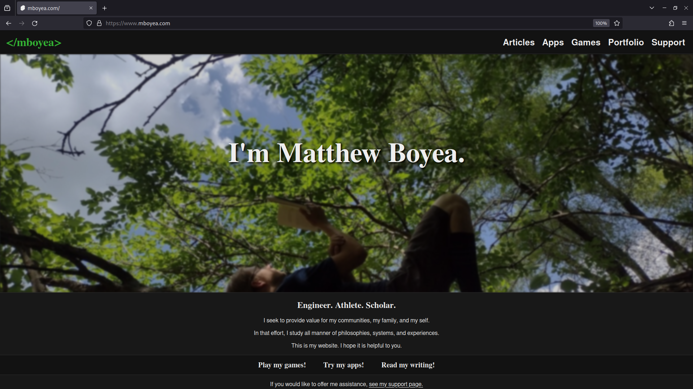

[www.mboyea.com](https://www.mboyea.com)
===
A portfolio website to host articles, apps, and games built by Matthew Boyea.
---
This website is built with [SvelteKit], [Typescript], & [Sass] to compile a html/css/js application delivered by a [Node.js] server. [PNPM] manages all dependency packages. [Docker] is used to compile the app into a minified [Ubuntu] environment. [Fly.io] hosts the Docker Image to serve the completed website.

### Install (Windows)
* [Install Git Bash](https://git-scm.com/download/win) for deployment scripts & GitHub commits.
* [Install Node](https://nodejs.org/en/download).
* [Install PNPM](https://pnpm.io/installation).
* [Install flyctl](https://fly.io/docs/hands-on/install-flyctl/) for deployments.
* [Install psql](https://www.timescale.com/blog/how-to-install-psql-on-mac-ubuntu-debian-windows/) for remote SQL deployment.
* Ensure each of the above command line tools are accessible by PATH.
* [Clone this repository](https://docs.github.com/en/repositories/creating-and-managing-repositories/cloning-a-repository#cloning-a-repository) to a directory on your computer. That directory will be referred to as `root`.
* Open a terminal in `root`.
* Run `pnpm i` in the terminal to install all remaining app dependencies.
From here, you can use & edit the app locally on your Windows machine. See ### Run Scripts for more information.

### Install (Arch Linux)
* Install `nodejs` from pacman.
* Install `pnpm` from pacman.
* Install `flyctl-bin` from the AUR.
* Install `postgresql` from pacman.
* [Clone this repository](https://docs.github.com/en/repositories/creating-and-managing-repositories/cloning-a-repository#cloning-a-repository) to a directory on your computer. That directory will be referred to as `root`.
* Open a terminal in `root`.
* Run `pnpm i` in the terminal to install all remaining app dependencies.
From here, you can use & edit the app locally on your Arch Linux machine. See ### Run Scripts for more information.

### Run Scripts
To run a script, type `pnpm run <script-name>` into a terminal within the root folder.

| script-name | description |
|:----------- |:----------- |
| `start` | run start:dev |
| `start:dev` | create a local hot-reloading server at [localhost:5173](http://localhost:5173) to serve source code files |
| `start:preview` | run build:preview, create a local server at [localhost:4173](http://localhost:4173) to serve built code files |
| `build:preview` | build app using .env.development |
| `build:prod` | build app using .env |
| `deploy` | update app dependencies, run build:prod, run deploy:database, run deploy:secrets, run deploy:server |
| `deploy:database` | update postgres users, databases, tables, procedures, etc. |
| `deploy:secrets` | set flyctl secrets from .env file |
| `deploy:server` | deploy build folder to flyctl |
| `check` | evaluate Svelte syntax |
| `check:watch` | re-evaluate Svelte syntax when files are updated |
| `article` | cli to modify articles in the postgres database; pass -h for more details |

### Create Secrets
Some features of this app require secret database credentials. These secrets cannot be shared in public.
* Obtain the secrets.
* Create a file named `.env` in the root directory.
* Copy the secrets into the `.env` file.
* Repeat for file named `.env.development`.

### Deploy
* Install Dependencies.
* Create Secrets.
* Open a terminal in the root folder.
* Run `pnpm run deploy`.
* If postgres access is denied: check .env password; check .env host; check port 5432 is free (use `netstat -ano | findstr :5432`)

### Contribute
Unfortunately, this project doesn't support community contributions right now. Feel free to fork, but be sure to [read the license](./LICENSE.md).

[SvelteKit]: https://kit.svelte.dev/docs/introduction
[Typescript]: https://www.typescriptlang.org/why-create-typescript
[Sass]: https://sass-lang.com/guide
[Node.js]: https://nodejs.org/en/docs/guides/getting-started-guide
[Docker]: https://docs.docker.com/get-started/overview/
[Ubuntu]: https://ubuntu.com/about
[PNPM]: https://pnpm.io/motivation
[Fly.io]: https://fly.io/docs/

